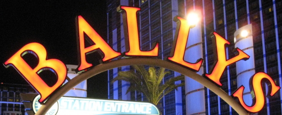
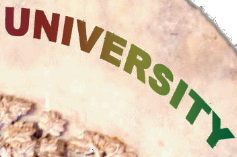

# Распознавание текста с изображения

#### Предсказывание результата

| Пример изображения                                            | [TRBA (**T**PS-**R**esNet-**B**iLSTM-**A**ttn)](https://drive.google.com/open?id=1b59rXuGGmKne1AuHnkgDzoYgKeETNMv9) |
|---------------------------------------------------------------|     ---      |
|                |   available   |
|                |    shakeshack    |
|                |   london   |
|                |    greenstead    |
|   |   toast   |
|   |    merry    |
|                |   underground   |
|                |    ronaldo    |
|   |   bally   |
|  |    university    |


### Обучение и оценка
1. Обучение CRNN[10] модели
```
CUDA_VISIBLE_DEVICES=0 python3 train.py \
--train_data data_lmdb_release/training --valid_data data_lmdb_release/validation \
--select_data MJ-ST --batch_ratio 0.5-0.5 \
--Transformation None --FeatureExtraction VGG --SequenceModeling BiLSTM --Prediction CTC
```
2. Тест CRNN[10] модели
```
CUDA_VISIBLE_DEVICES=0 python3 test.py \
--eval_data data_lmdb_release/evaluation --benchmark_all_eval \
--Transformation None --FeatureExtraction VGG --SequenceModeling BiLSTM --Prediction CTC \
--saved_model saved_models/None-VGG-BiLSTM-CTC-Seed1111/best_accuracy.pth
```

### Аргументы
* `--train_data`: путь к папке с обучающим датасетом imdb.
* `--valid_data`: путь к папке для проверки датасета imdb.
* `--eval_data`: путь к папке для оценки (с test.py ) датасета lmdb.
* `--select_data`: выбор обучающего датасета. значение по умолчанию - MOST, что означает, что MJ и ST используются в качестве обучающих данных.
* `--batch_ratio`: назначенное соотношение для каждого выбранного пакета данных. значение по умолчанию равно 0,5-0,5, что означает, что 50% партии заполнено MJ, а остальные 50% партии заполнены ST.
* `--data_filtering_off`: пропустить при создании набора данных Imdb.
* `--Transformation`: выбор модуля преобразования [None | TPS].
* `--FeatureExtraction`: выбор модуля извлечения объектов [VGG | RCNN | ResNet].
* `--SequenceModeling`: выбор модуля моделирования последовательности [None | BiLSTM].
* `--Prediction`: выбор модуля прогнозирования [CTC | Attn].
* `--saved_model`: назначение сохраненной модели для оценки.
* `--benchmark_all_eval`: оценка с помощью 10 версий оценочного набора данных, аналогично таблице 1 в нашей статье.


## Использование бота
Для использования функционала создан [бот](https://t.me/CoolScannerBot) в телеграмме. <br>
Стартуем бота командой `\start`, дальше отправляем картинку форматом `*.png` или `*.jpg`. <br>
Если бот смог распрсить картинку и определить текст на ней - он отправит ответным сообщением слово с картинки. <br>
Если бот не смог распознать текст - отправить соответствующее сообщение об ошибке.

## Демонстрация работы бота
Для запуска бота пишем ему /start а потом прикрепляем фото с текстом

1. Изображение с текстов “Available”.

2. Изображение с текстом “shakeshack”.

3. Изображение с текстом “MERRY”.

4. Изображение с текстом “helloworld”


## Источники
[1] M. Jaderberg, K. Simonyan, A. Vedaldi, and A. Zisserman. Synthetic data and artificial neural networks for natural scenetext  recognition. In Workshop on Deep Learning, NIPS, 2014. <br>
[2] A. Gupta, A. Vedaldi, and A. Zisserman. Synthetic data fortext localisation in natural images. In CVPR, 2016. <br>
[3] D. Karatzas, F. Shafait, S. Uchida, M. Iwamura, L. G. i Big-orda, S. R. Mestre, J. Mas, D. F. Mota, J. A. Almazan, andL. P. De Las Heras. ICDAR 2013 robust reading competition. In ICDAR, pages 1484–1493, 2013. <br>
[4] D. Karatzas, L. Gomez-Bigorda, A. Nicolaou, S. Ghosh, A. Bagdanov, M. Iwamura, J. Matas, L. Neumann, V. R.Chandrasekhar, S. Lu, et al. ICDAR 2015 competition on ro-bust reading. In ICDAR, pages 1156–1160, 2015. <br>
[5] A. Mishra, K. Alahari, and C. Jawahar. Scene text recognition using higher order language priors. In BMVC, 2012. <br>
[6] K. Wang, B. Babenko, and S. Belongie. End-to-end scenetext recognition. In ICCV, pages 1457–1464, 2011. <br>
[7] S. M. Lucas, A. Panaretos, L. Sosa, A. Tang, S. Wong, andR. Young. ICDAR 2003 robust reading competitions. In ICDAR, pages 682–687, 2003. <br>
[8] T. Q. Phan, P. Shivakumara, S. Tian, and C. L. Tan. Recognizing text with perspective distortion in natural scenes. In ICCV, pages 569–576, 2013. <br>
[9] A. Risnumawan, P. Shivakumara, C. S. Chan, and C. L. Tan. A robust arbitrary text detection system for natural scene images. In ESWA, volume 41, pages 8027–8048, 2014. <br>
[10] B. Shi, X. Bai, and C. Yao. An end-to-end trainable neural network for image-based sequence recognition and its application to scene text recognition. In TPAMI, volume 39, pages2298–2304. 2017. 
