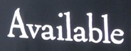
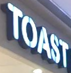

# Что Не Так Со Сравнениями Моделей Распознавания Текста Фото? Анализ набора данных и модели

Официальная реализация PyTorch нашей четырехэтапной структуры STR, в которую вписывается большинство существующих моделей STR. <br>
Использование этой структуры позволяет вносить вклад в производительность по модулю с точки зрения точности, скорости и потребности в памяти в рамках одного согласованного набора из наборов данных для обучения и оценки. <br>
Такой анализ устраняет препятствия для текущих сравнений, чтобы понять прирост производительности существующих модулей. <br><br>


### Загрузить набор данных imdb для обучения и оценки [здесь](https://www.dropbox.com/sh/i39abvnefllx2si/AAAbAYRvxzRp3cIE5HzqUw3ra?dl=0)
data_lmdb_release.zip содержится ниже. <br>
Обучающий датасет : [MJSynth (MJ)](http://www.robots.ox.ac.uk/~vgg/data/text/)[1] and [SynthText (ST)](http://www.robots.ox.ac.uk/~vgg/data/scenetext/)[2] \
Валидационный датасет : the union of the training sets [IC13](http://rrc.cvc.uab.es/?ch=2)[3], [IC15](http://rrc.cvc.uab.es/?ch=4)[4], [IIIT](http://cvit.iiit.ac.in/projects/SceneTextUnderstanding/IIIT5K.html)[5], and [SVT](http://www.iapr-tc11.org/mediawiki/index.php/The_Street_View_Text_Dataset)[6].\
Оценочный датасет : benchmark evaluation datasets, consist of [IIIT](http://cvit.iiit.ac.in/projects/SceneTextUnderstanding/IIIT5K.html)[5], [SVT](http://www.iapr-tc11.org/mediawiki/index.php/The_Street_View_Text_Dataset)[6], [IC03](http://www.iapr-tc11.org/mediawiki/index.php/ICDAR_2003_Robust_Reading_Competitions)[7], [IC13](http://rrc.cvc.uab.es/?ch=2)[3], [IC15](http://rrc.cvc.uab.es/?ch=4)[4], [SVTP](http://openaccess.thecvf.com/content_iccv_2013/papers/Phan_Recognizing_Text_with_2013_ICCV_paper.pdf)[8], and [CUTE](http://cs-chan.com/downloads_CUTE80_dataset.html)[9].

#### Предсказывание результата

| Пример изображения                                            | [TRBA (**T**PS-**R**esNet-**B**iLSTM-**A**ttn)](https://drive.google.com/open?id=1b59rXuGGmKne1AuHnkgDzoYgKeETNMv9) | [TRBA (case-sensitive version)](https://drive.google.com/open?id=1ajONZOgiG9pEYsQ-eBmgkVbMDuHgPCaY) |
|---------------------------------------------------------------|     ---      |          --- |
|                |   available   |  Available   |
|                |    shakeshack    |   SHARESHACK    |
|                |   london   |  Londen   |
|                |    greenstead    |   Greenstead    |
|   |   toast   |  TOAST   |
|   |    merry    |   MERRY    |
|                |   underground   |   underground  |
|                |    ronaldo    |    RONALDO   |
|   |   bally   |   BALLY  |
|  |    university    |   UNIVERSITY    |


### Обучение и оценка
1. обучение CRNN[10] модели
```
CUDA_VISIBLE_DEVICES=0 python3 train.py \
--train_data data_lmdb_release/training --valid_data data_lmdb_release/validation \
--select_data MJ-ST --batch_ratio 0.5-0.5 \
--Transformation None --FeatureExtraction VGG --SequenceModeling BiLSTM --Prediction CTC
```
2. Тест CRNN[10] модели.
```
CUDA_VISIBLE_DEVICES=0 python3 test.py \
--eval_data data_lmdb_release/evaluation --benchmark_all_eval \
--Transformation None --FeatureExtraction VGG --SequenceModeling BiLSTM --Prediction CTC \
--saved_model saved_models/None-VGG-BiLSTM-CTC-Seed1111/best_accuracy.pth
```

3. Попробуйте обучить и протестировать нашу лучшую модель точности TRBA (**T**PS-**R**esNet-**B**iLSTM-**A**ttn) also. ([download pretrained model](https://drive.google.com/drive/folders/15WPsuPJDCzhp2SvYZLRj8mAlT3zmoAMW))
```
CUDA_VISIBLE_DEVICES=0 python3 train.py \
--train_data data_lmdb_release/training --valid_data data_lmdb_release/validation \
--select_data MJ-ST --batch_ratio 0.5-0.5 \
--Transformation TPS --FeatureExtraction ResNet --SequenceModeling BiLSTM --Prediction Attn
```
```
CUDA_VISIBLE_DEVICES=0 python3 test.py \
--eval_data data_lmdb_release/evaluation --benchmark_all_eval \
--Transformation TPS --FeatureExtraction ResNet --SequenceModeling BiLSTM --Prediction Attn \
--saved_model saved_models/TPS-ResNet-BiLSTM-Attn-Seed1111/best_accuracy.pth
```

### Arguments
* `--train_data`: путь к папке с обучающим датасетом imdb.
* `--valid_data`: путь к папке для проверки датасета imdb.
* `--eval_data`: путь к папке для оценки (с test.py ) датасета lmdb.
* `--select_data`: выбор обучающего датасета. значение по умолчанию - MOST, что означает, что MJ и ST используются в качестве обучающих данных.
* `--batch_ratio`: назначенное соотношение для каждого выбранного пакета данных. значение по умолчанию равно 0,5-0,5, что означает, что 50% партии заполнено MJ, а остальные 50% партии заполнены ST.
* `--data_filtering_off`: пропустить при создании набора данных Imdb.
* `--Transformation`: выбор модуля преобразования [None | TPS].
* `--FeatureExtraction`: выбор модуля извлечения объектов [VGG | RCNN | ResNet].
* `--SequenceModeling`: выбор модуля моделирования последовательности [None | BiLSTM].
* `--Prediction`: выбор модуля прогнозирования [CTC | Attn].
* `--saved_model`: назначение сохраненной модели для оценки.
* `--benchmark_all_eval`: оценка с помощью 10 версий оценочного набора данных, аналогично таблице 1 в нашей статье.

## Загрузить случаи сбоев и очищенную метку [здесь](https://www.dropbox.com/s/5knh1gb1z593fxj/image_release_190624.zip?dl=0)
image_release.zip содержит изображения случаев сбоев и изображения эталонной оценки с очищенной меткой.


## Когда вам нужно тренироваться на вашем собственном наборе данных или наборах данных на нелатинском языке.
1. Создать свой собственный набор данных imdb.
```
pip3 install fire
python3 create_lmdb_dataset.py --inputPath data/ --gtFile data/gt.txt --outputPath result/
```
Структура папки данных, как показано ниже.
```
data
├── gt.txt
└── test
    ├── word_1.png
    ├── word_2.png
    ├── word_3.png
    └── ...
```
В это время, `gt.txt` должен быть `{imagepath}\t{label}\n` <br>
Для примера
```
test/word_1.png Tiredness
test/word_2.png kills
test/word_3.png A
...
```
2. Модифицировать `--select_data`, `--batch_ratio`, и `opt.character`

## Использование бота
Для использования функционала создан [бот](https://t.me/CoolScannerBot) в телеграмме. <br>
Стартуем бота командой `\start`, дальше отправляем картинку форматом `*.png` или `*.jpg`. <br>
Если бот смог распрсить картинку и определить текст на ней - он отправит ответным сообщением слово с картинки. <br>
Если бот не смог распознать текст - отправить соответствующее сообщение об ошибке.

## Источники
[1] M. Jaderberg, K. Simonyan, A. Vedaldi, and A. Zisserman. Synthetic data and artificial neural networks for natural scenetext  recognition. In Workshop on Deep Learning, NIPS, 2014. <br>
[2] A. Gupta, A. Vedaldi, and A. Zisserman. Synthetic data fortext localisation in natural images. In CVPR, 2016. <br>
[3] D. Karatzas, F. Shafait, S. Uchida, M. Iwamura, L. G. i Big-orda, S. R. Mestre, J. Mas, D. F. Mota, J. A. Almazan, andL. P. De Las Heras. ICDAR 2013 robust reading competition. In ICDAR, pages 1484–1493, 2013. <br>
[4] D. Karatzas, L. Gomez-Bigorda, A. Nicolaou, S. Ghosh, A. Bagdanov, M. Iwamura, J. Matas, L. Neumann, V. R.Chandrasekhar, S. Lu, et al. ICDAR 2015 competition on ro-bust reading. In ICDAR, pages 1156–1160, 2015. <br>
[5] A. Mishra, K. Alahari, and C. Jawahar. Scene text recognition using higher order language priors. In BMVC, 2012. <br>
[6] K. Wang, B. Babenko, and S. Belongie. End-to-end scenetext recognition. In ICCV, pages 1457–1464, 2011. <br>
[7] S. M. Lucas, A. Panaretos, L. Sosa, A. Tang, S. Wong, andR. Young. ICDAR 2003 robust reading competitions. In ICDAR, pages 682–687, 2003. <br>
[8] T. Q. Phan, P. Shivakumara, S. Tian, and C. L. Tan. Recognizing text with perspective distortion in natural scenes. In ICCV, pages 569–576, 2013. <br>
[9] A. Risnumawan, P. Shivakumara, C. S. Chan, and C. L. Tan. A robust arbitrary text detection system for natural scene images. In ESWA, volume 41, pages 8027–8048, 2014. <br>
[10] B. Shi, X. Bai, and C. Yao. An end-to-end trainable neural network for image-based sequence recognition and its application to scene text recognition. In TPAMI, volume 39, pages2298–2304. 2017. 

## Ссылки
- WebDemo : https://demo.ocr.clova.ai/ <br>
Combination of Clova AI detection and recognition, additional/advanced features used for KOR/JPN.
- Repo of detection : https://github.com/clovaai/CRAFT-pytorch


